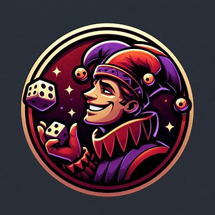

<h1>
  
  DrawMaster
  
</h1>

A Discord bot that splits users in a voice channel into teams or randomly picks a winner — ideal for quick team matchups and fun contests.

## 🚀 Features

- **/teamup** command: Teams up users in a voice channel randomly.
- **/winner** command: Selects a random winner among users in the same voice channel.
- Student-built project for casual and competitive Discord gaming communities.

## 🕹️ Usage

Add the bot to your Discord server, then use the following slash commands:

```bash
/teamup
/winner
```

## 🎬 Demo Videos

### `/teamup` Demo

1. Split into 2 teams

https://github.com/user-attachments/assets/17447bcb-d52b-442e-aadb-5d0e13b0239b

2. Split into 3 teams

https://github.com/user-attachments/assets/61ad63b9-7e7b-451d-a28d-f5aa7f84edd6

3. Teamup with channel option

https://github.com/user-attachments/assets/12111bc0-96ef-44ab-a9cb-7f5f64b19ee2

### `/winner` Demo

https://github.com/user-attachments/assets/e147845c-fb27-44ee-a68b-a895ab1a4c40

## ⚙️ Installation

1. **Clone the repository:**

    ```bash
    git clone <repo-url>
    cd Discord-Bot
    ```

2. **Create a `Secrets.toml` file** with the following format:

    ```toml
    DISCORD_TOKEN = "your-bot-token-here"
    GUILD_ID = "your-discord-guild-id"
    ```

3. **Build and run the project:**

    Using Shuttle:
    ```bash
    cargo shuttle run --release
    ```

    Or using Docker:
    ```bash
    docker build -t drawmaster .
    docker run -d --name drawmaster drawmaster
    ```

## 📦 Dependencies

Dependencies are managed via `Cargo.toml` and locked in `Cargo.lock`.

## 📄 License

This project uses the MIT license.

## 👥 Authors

- [WSm-77](https://github.com/WSm-77)
- [NCCMNT](https://github.com/NCCMNT)

## 🎯 Target Audience

- Gamers using Discord voice channels.


